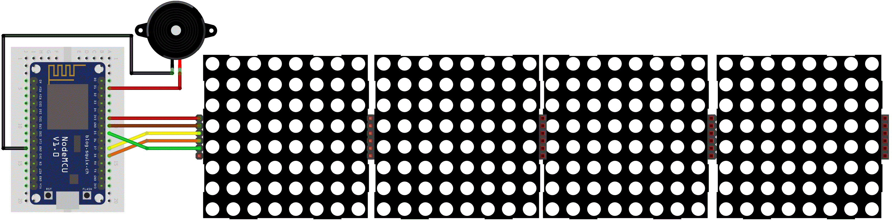

# Initial setup

Board Wiring
---------------------------------


Specify number of LED modules used (change the below value in 01_Shared.h to 8, 12, etc..): 
```
#define MAX_DEVICES 4
```

MAX7219 Pinout Code Definition (change pin below in 01_Shared.h if you use different pins):
```
#define CLK_PIN   D5  // or SCK
#define DATA_PIN  D7  // or MOSI
#define CS_PIN    D6  // CS
```

Buzzer Pinout Code Definition (change pin below in 01_Shared.h if you use different pins):
```
#define BUZZER D1
```

## WiFi Setup Mode (on first start or on config wipe)

You'll need to configure your WiFi network by connecting to:
```
WiFi SSID: ESP-MSG-ABCDEF  (where ABCDEF are the last 6 digit of the ESP8266 MAC address)
WiFi Secret: wifi-setup
```
Start a Web browser and most recent browsers should open/redirect automatically and browse to http://192.168.4.1, thereafter:
1. Click on "Configure WiFi"
2. Enter your Wifi details
3. Click on "Save"

The board will reboot and should now boot in "WiFi Message Mode".

Connect to your WiFi network and look for the IP the board obtained from DHCP (it should be displayed once at the end of the first message upon boot).

I suggest statically assigning an IP on your DHCP so the board always uses the same IP and can be easily accessed. (This is not important for MQTT Messaging but it is for HTTP Web Interface/Messaging).

**Note:** Locally you can also use the hostname in mDNS format "ESP-MSG-ABCDEF.local" instead of the IP address.

## Default username and password:
```
username: admin
password: esp8266
```

You can enable `#define ENABLE_FLASH_BUTTON 1` in `01_Shared.h` to use the ESP FLASH button on the ESP8266 or browse to /factoryreset to reset username and password to admin/esp8266, wipe WiFi and MQTT configuration and reset the board (the "RST" button only restarts the board with no changes)***
